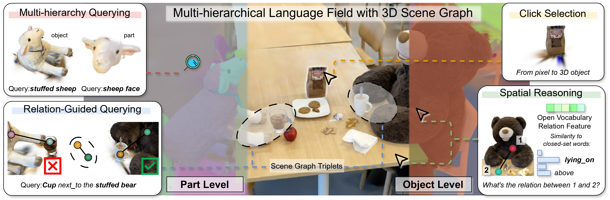

# ReLaGS: Relational Language Gaussian Splatting

**CVPR 2025**

[Yaxu Xie](https://scholar.google.com/citations?user=3ZKuh9EAAAAJ&hl=en)\* · [Abdalla Arafa](https://abdallaarafa.github.io/)\* · [Alireza Javanmardi](https://scholar.google.com/citations?user=SR_4n3kAAAAJ&hl=en) · [Christen Millerdurai](https://chris10m.github.io/) · [Jia Cheng Hu](https://scholar.google.com/citations?user=KxUF6BUAAAAJ&hl=it) · [Shaoxiang Wang](https://shaoxiang777.github.io/) · [Alain Pagani](https://www.dfki.de/en/web/about-us/employee/person/alpa02) · [Didier Stricker](https://www.dfki.de/en/web/about-us/employee/person/dist01)

<sup>\*Equal contribution</sup>

**¹ German Research Center for Artificial Intelligence (DFKI) · ² RPTU University Kaiserslautern-Landau · ³ University of Modena and Reggio Emilia**

[](about:blank)
[](https://dfki-av.github.io/ReLaGS/)

---



***Relational Language Gaussian Splatting.*** We build a platform with multi-hierarchical language Gaussian field and open-vocabulary 3D scene graph, to support various tasks such as object selection via click, open vocabulary 3D object segmentation across semantic granularity, spatial relationship reasoning between objects and querying object with relation-guidance.

---

## Abstract

Achieving unified 3D perception and reasoning across tasks such as segmentation, retrieval, and relation understanding remains challenging, as existing methods are either object-centric or rely on costly training for inter-object reasoning. We present a novel framework that constructs a hierarchical language-distilled Gaussian scene and its 3D semantic scene graph without scene-specific training. A Gaussian pruning mechanism refines scene geometry, while a robust multi-view language alignment strategy aggregates noisy 2D features into accurate 3D object embeddings. On top of this hierarchy, we build an open-vocabulary 3D scene graph with Vision Language-derived annotations and Graph Neural Network-based relational reasoning. Our approach enables efficient and scalable open-vocabulary 3D reasoning by jointly modeling hierarchical semantics and inter/intra-object relationships, validated across tasks including open-vocabulary segmentation, scene graph generation, and relation-guided retrieval.

---

## Citation

If you find our work useful, please cite:

```bibtex
@inproceedings{xiearafa2026relags,
  title     = {ReLaGS: Relational Language Gaussian Splatting},
  author    = {Xie, Yaxu and Arafa, Abdalla and Javanmardi, Alireza and Millerdurai, Christen and Hu, Jia Cheng and Wang, Shaoxiang and Pagani, Alain and Stricker, Didier},
  booktitle = {Proceedings of the IEEE/CVF Conference on Computer Vision and Pattern Recognition (CVPR)},
  year      = {2026}
}
```

---

## Acknowledgement

This work has been partially funded by the EU projects dAIEDGE (GA Nr 101120726) and LUMINOUS (GA Nr 101135724).
